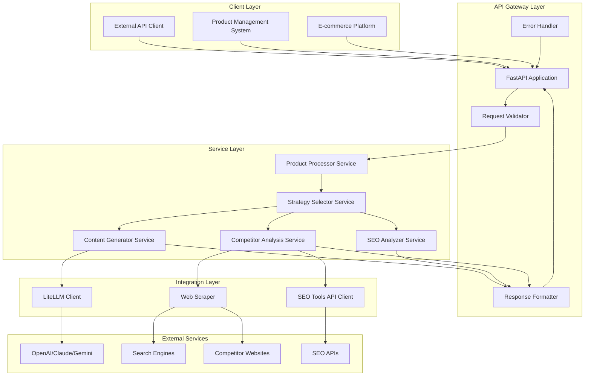
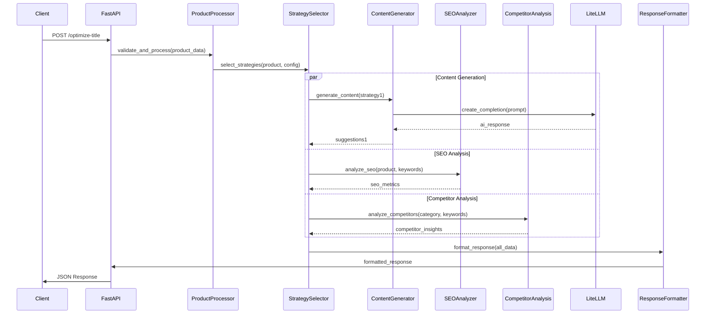

# SEO Meta Title & Description Optimization API - Detailed Design Document

## Table of Contents
1. [System Architecture](#system-architecture)
2. [Data Models & Schemas](#data-models--schemas)
3. [API Specifications](#api-specifications)
4. [Service Layer Design](#service-layer-design)
5. [AI Integration Architecture](#ai-integration-architecture)
6. [SEO Scoring Engine](#seo-scoring-engine)
7. [Competitor Analysis Engine](#competitor-analysis-engine)
8. [Error Handling & Logging](#error-handling--logging)
9. [Configuration Management](#configuration-management)
10. [Deployment Architecture](#deployment-architecture)
11. [Security Design](#security-design)
12. [Performance Optimization](#performance-optimization)

## System Architecture

### High-Level Component Diagram



### Component Interaction Flow



## Data Models & Schemas

### Core Data Models

```python
from pydantic import BaseModel, Field, validator
from typing import List, Optional, Dict, Any
from enum import Enum

class OptimizationStrategy(str, Enum):
    KEYWORD_FOCUSED = "keyword_focused"
    BENEFIT_DRIVEN = "benefit_driven"
    EMOTIONAL_APPEAL = "emotional_appeal"
    TECHNICAL_SPECS = "technical_specs"
    BRAND_CENTRIC = "brand_centric"

class ProductInput(BaseModel):
    current_title: str = Field(..., min_length=1, max_length=200, description="Current product title")
    features: List[str] = Field(..., min_items=1, max_items=20, description="Product features list")
    category: str = Field(..., min_length=1, max_length=100, description="Product category")
    brand: Optional[str] = Field(None, max_length=50, description="Brand name")
    price_range: Optional[str] = Field(None, max_length=50, description="Price range (e.g., '$100-200')")
    target_audience: Optional[str] = Field(None, max_length=100, description="Target audience description")
    keywords: Optional[List[str]] = Field(None, max_items=10, description="Target keywords")
    
    @validator('features')
    def validate_features(cls, v):
        if not v or len(v) == 0:
            raise ValueError('At least one feature is required')
        return [feature.strip() for feature in v if feature.strip()]
    
    @validator('keywords')
    def validate_keywords(cls, v):
        if v:
            return [keyword.strip().lower() for keyword in v if keyword.strip()]
        return v

class OptimizationConfig(BaseModel):
    strategies: List[OptimizationStrategy] = Field(
        default=[OptimizationStrategy.KEYWORD_FOCUSED], 
        min_items=1, 
        max_items=5,
        description="Optimization strategies to apply"
    )
    competitor_analysis: bool = Field(default=True, description="Enable competitor analysis")
    max_suggestions: int = Field(default=5, ge=1, le=10, description="Maximum number of suggestions")
    include_descriptions: bool = Field(default=True, description="Include meta descriptions")
    target_title_length: int = Field(default=60, ge=30, le=80, description="Target title character length")
    target_description_length: int = Field(default=160, ge=120, le=200, description="Target description length")

class CharacterCounts(BaseModel):
    title: int = Field(..., description="Title character count")
    description: int = Field(..., description="Description character count")

class TitleSuggestion(BaseModel):
    title: str = Field(..., description="Optimized title suggestion")
    description: str = Field(..., description="Optimized meta description")
    strategy: OptimizationStrategy = Field(..., description="Strategy used for this suggestion")
    seo_score: float = Field(..., ge=0, le=100, description="SEO score (0-100)")
    character_counts: CharacterCounts = Field(..., description="Character count analysis")
    keywords_used: List[str] = Field(..., description="Keywords incorporated in the suggestion")
    optimization_notes: str = Field(..., description="Notes about the optimization approach")

class CompetitorInsight(BaseModel):
    common_keywords: List[str] = Field(..., description="Frequently used keywords by competitors")
    title_patterns: List[str] = Field(..., description="Common title patterns observed")
    recommendations: List[str] = Field(..., description="Recommendations based on competitor analysis")
    avg_title_length: float = Field(..., description="Average competitor title length")
    avg_description_length: float = Field(..., description="Average competitor description length")

class SEOAnalysis(BaseModel):
    original_score: float = Field(..., ge=0, le=100, description="Original title SEO score")
    best_suggestion_score: float = Field(..., ge=0, le=100, description="Best suggestion SEO score")
    improvement_percentage: float = Field(..., description="Percentage improvement")
    keyword_density_analysis: Dict[str, float] = Field(..., description="Keyword density metrics")
    readability_score: float = Field(..., ge=0, le=100, description="Content readability score")

class OptimizationResponse(BaseModel):
    suggestions: List[TitleSuggestion] = Field(..., description="List of optimization suggestions")
    competitor_insights: Optional[CompetitorInsight] = Field(None, description="Competitor analysis results")
    seo_analysis: SEOAnalysis = Field(..., description="SEO analysis and scoring")
    processing_time_ms: int = Field(..., description="Total processing time in milliseconds")
    request_id: str = Field(..., description="Unique request identifier")

class ErrorResponse(BaseModel):
    error: str = Field(..., description="Error type")
    message: str = Field(..., description="Human-readable error message")
    details: Optional[Dict[str, Any]] = Field(None, description="Additional error details")
    request_id: str = Field(..., description="Request identifier for tracking")
    timestamp: str = Field(..., description="Error timestamp in ISO format")
```

### Validation Rules

```python
class ValidationRules:
    # Title validation
    MIN_TITLE_LENGTH = 10
    MAX_TITLE_LENGTH = 200
    OPTIMAL_TITLE_LENGTH_MIN = 50
    OPTIMAL_TITLE_LENGTH_MAX = 60
    
    # Description validation
    MIN_DESCRIPTION_LENGTH = 50
    MAX_DESCRIPTION_LENGTH = 300
    OPTIMAL_DESCRIPTION_LENGTH_MIN = 150
    OPTIMAL_DESCRIPTION_LENGTH_MAX = 160
    
    # Feature validation
    MAX_FEATURES = 20
    MIN_FEATURES = 1
    MAX_FEATURE_LENGTH = 100
    
    # Keyword validation
    MAX_KEYWORDS = 10
    MAX_KEYWORD_LENGTH = 50
    
    # Content validation patterns
    FORBIDDEN_CHARS = ['<', '>', '{', '}', '[', ']']
    REQUIRED_TITLE_ELEMENTS = ['product_name', 'key_benefit']
    
    @staticmethod
    def validate_title_quality(title: str) -> Dict[str, bool]:
        return {
            'has_numbers': any(char.isdigit() for char in title),
            'has_brand': True,  # Logic to detect brand presence
            'has_keywords': True,  # Logic to detect keyword presence
            'proper_capitalization': title.istitle(),
            'no_forbidden_chars': not any(char in title for char in ValidationRules.FORBIDDEN_CHARS)
        }
```

## API Specifications

### Endpoint Definition

```python
from fastapi import FastAPI, HTTPException, Depends, Request
from fastapi.middleware.cors import CORSMiddleware
from fastapi.middleware.gzip import GZipMiddleware
import time
import uuid

app = FastAPI(
    title="SEO Meta Title & Description Optimization API",
    description="AI-powered SEO optimization for product titles and descriptions",
    version="1.0.0",
    docs_url="/docs",
    redoc_url="/redoc"
)

# Middleware configuration
app.add_middleware(
    CORSMiddleware,
    allow_origins=["*"],  # Configure based on environment
    allow_credentials=True,
    allow_methods=["GET", "POST"],
    allow_headers=["*"],
)

app.add_middleware(GZipMiddleware, minimum_size=1000)

@app.middleware("http")
async def add_process_time_header(request: Request, call_next):
    start_time = time.time()
    request.state.request_id = str(uuid.uuid4())
    response = await call_next(request)
    process_time = time.time() - start_time
    response.headers["X-Process-Time"] = str(process_time)
    response.headers["X-Request-ID"] = request.state.request_id
    return response

class OptimizationRequest(BaseModel):
    product: ProductInput
    optimization_config: OptimizationConfig = OptimizationConfig()

@app.post(
    "/optimize-title",
    response_model=OptimizationResponse,
    responses={
        200: {"description": "Successful optimization"},
        400: {"model": ErrorResponse, "description": "Invalid input data"},
        422: {"model": ErrorResponse, "description": "Validation error"},
        500: {"model": ErrorResponse, "description": "Internal server error"},
        503: {"model": ErrorResponse, "description": "External service unavailable"}
    },
    summary="Optimize Product Title and Description",
    description="Generate SEO-optimized title and description suggestions for a product"
)
async def optimize_title(
    request: OptimizationRequest,
    http_request: Request,
    optimization_service: OptimizationService = Depends(get_optimization_service)
):
    """
    Generate SEO-optimized title and description suggestions.
    
    - **product**: Product information including current title, features, category
    - **optimization_config**: Configuration for optimization strategies and parameters
    
    Returns multiple suggestions with SEO scores and analysis.
    """
    try:
        result = await optimization_service.optimize(
            product=request.product,
            config=request.optimization_config,
            request_id=http_request.state.request_id
        )
        return result
    except ValidationError as e:
        raise HTTPException(status_code=422, detail=str(e))
    except ExternalServiceError as e:
        raise HTTPException(status_code=503, detail=str(e))
    except Exception as e:
        raise HTTPException(status_code=500, detail="Internal server error")

@app.get("/health")
async def health_check():
    """Health check endpoint for monitoring and load balancers."""
    return {
        "status": "healthy",
        "timestamp": time.time(),
        "version": "1.0.0"
    }

@app.get("/metrics")
async def get_metrics():
    """Basic metrics endpoint for monitoring."""
    return {
        "requests_processed": metrics.get_request_count(),
        "average_response_time": metrics.get_avg_response_time(),
        "error_rate": metrics.get_error_rate(),
        "ai_api_calls": metrics.get_ai_api_calls()
    }
```

### Request/Response Examples

```json
// Request Example
{
  "product": {
    "current_title": "Wireless Bluetooth Headphones",
    "features": [
      "Active Noise Cancellation",
      "30-hour battery life",
      "Quick charge 15min = 3hrs",
      "Premium sound quality",
      "Comfortable over-ear design"
    ],
    "category": "Electronics/Audio",
    "brand": "TechSound",
    "price_range": "$150-200",
    "target_audience": "Music enthusiasts and professionals",
    "keywords": ["wireless headphones", "noise cancelling", "bluetooth"]
  },
  "optimization_config": {
    "strategies": ["keyword_focused", "benefit_driven"],
    "competitor_analysis": true,
    "max_suggestions": 3,
    "include_descriptions": true,
    "target_title_length": 60,
    "target_description_length": 160
  }
}

// Response Example
{
  "suggestions": [
    {
      "title": "TechSound Wireless Bluetooth Headphones - 30Hr Battery & Active Noise Cancelling",
      "description": "Experience premium sound with TechSound wireless Bluetooth headphones. Features 30-hour battery, active noise cancellation, and quick 15-minute charge for 3 hours of playtime. Perfect for music lovers.",
      "strategy": "keyword_focused",
      "seo_score": 87.5,
      "character_counts": {
        "title": 78,
        "description": 158
      },
      "keywords_used": ["wireless", "bluetooth", "headphones", "noise cancelling"],
      "optimization_notes": "Incorporated primary keywords in title, emphasized key benefits, optimized for search intent"
    }
  ],
  "competitor_insights": {
    "common_keywords": ["wireless", "bluetooth", "noise cancelling", "battery"],
    "title_patterns": ["Brand + Product + Key Feature", "Feature + Product + Brand"],
    "recommendations": ["Include battery life in title", "Emphasize noise cancellation"],
    "avg_title_length": 65.2,
    "avg_description_length": 155.8
  },
  "seo_analysis": {
    "original_score": 45.2,
    "best_suggestion_score": 87.5,
    "improvement_percentage": 93.6,
    "keyword_density_analysis": {
      "wireless": 0.08,
      "bluetooth": 0.06,
      "headphones": 0.12
    },
    "readability_score": 78.3
  },
  "processing_time_ms": 2340,
  "request_id": "req_123e4567-e89b-12d3-a456-426614174000"
}
```

## Service Layer Design

### Service Architecture

```python
from abc import ABC, abstractmethod
from typing import List, Dict, Any, Optional
import asyncio
from dataclasses import dataclass

@dataclass
class ServiceConfig:
    ai_provider: str = "openai"
    ai_model: str = "gpt-3.5-turbo"
    max_retries: int = 3
    timeout_seconds: int = 30
    enable_competitor_analysis: bool = True
    enable_caching: bool = False  # Disabled for stateless design

class BaseService(ABC):
    def __init__(self, config: ServiceConfig):
        self.config = config
        self.logger = get_logger(self.__class__.__name__)
    
    @abstractmethod
    async def process(self, *args, **kwargs):
        pass

class OptimizationService(BaseService):
    def __init__(
        self,
        config: ServiceConfig,
        product_processor: 'ProductProcessorService',
        strategy_selector: 'StrategySelectorService',
        content_generator: 'ContentGeneratorService',
        seo_analyzer: 'SEOAnalyzerService',
        competitor_analyzer: 'CompetitorAnalysisService'
    ):
        super().__init__(config)
        self.product_processor = product_processor
        self.strategy_selector = strategy_selector
        self.content_generator = content_generator
        self.seo_analyzer = seo_analyzer
        self.competitor_analyzer = competitor_analyzer
    
    async def optimize(
        self, 
        product: ProductInput, 
        config: OptimizationConfig,
        request_id: str
    ) -> OptimizationResponse:
        start_time = time.time()
        
        try:
            # Step 1: Process and validate product data
            processed_product = await self.product_processor.process(product)
            
            # Step 2: Select optimization strategies
            strategies = await self.strategy_selector.select_strategies(
                processed_product, config
            )
            
            # Step 3: Parallel processing of different components
            tasks = []
            
            # Content generation for each strategy
            for strategy in strategies:
                task = self.content_generator.generate_content(
                    processed_product, strategy, config
                )
                tasks.append(task)
            
            # SEO analysis
            seo_task = self.seo_analyzer.analyze(processed_product, config)
            tasks.append(seo_task)
            
            # Competitor analysis (if enabled)
            competitor_task = None
            if config.competitor_analysis:
                competitor_task = self.competitor_analyzer.analyze(
                    processed_product.category,
                    processed_product.keywords or []
                )
                tasks.append(competitor_task)
            
            # Execute all tasks concurrently
            results = await asyncio.gather(*tasks, return_exceptions=True)
            
            # Process results
            suggestions = []
            seo_analysis = None
            competitor_insights = None
            
            for i, result in enumerate(results):
                if isinstance(result, Exception):
                    self.logger.error(f"Task {i} failed: {result}")
                    continue
                
                if isinstance(result, list):  # Content generation results
                    suggestions.extend(result)
                elif isinstance(result, SEOAnalysis):
                    seo_analysis = result
                elif isinstance(result, CompetitorInsight):
                    competitor_insights = result
            
            # Sort suggestions by SEO score
            suggestions.sort(key=lambda x: x.seo_score, reverse=True)
            suggestions = suggestions[:config.max_suggestions]
            
            processing_time = int((time.time() - start_time) * 1000)
            
            return OptimizationResponse(
                suggestions=suggestions,
                competitor_insights=competitor_insights,
                seo_analysis=seo_analysis,
                processing_time_ms=processing_time,
                request_id=request_id
            )
            
        except Exception as e:
            self.logger.error(f"Optimization failed for request {request_id}: {e}")
            raise

class ProductProcessorService(BaseService):
    async def process(self, product: ProductInput) -> ProcessedProduct:
        """Process and enrich product data."""
        
        # Extract keywords from title and features if not provided
        extracted_keywords = []
        if not product.keywords:
            extracted_keywords = await self._extract_keywords(
                product.current_title, product.features
            )
        
        # Classify product category
        category_info = await self._classify_category(product.category)
        
        # Analyze target audience
        audience_insights = await self._analyze_audience(product.target_audience)
        
        return ProcessedProduct(
            original=product,
            extracted_keywords=extracted_keywords,
            category_info=category_info,
            audience_insights=audience_insights,
            feature_analysis=await self._analyze_features(product.features)
        )
    
    async def _extract_keywords(self, title: str, features: List[str]) -> List[str]:
        """Extract relevant keywords from title and features."""
        # Implementation for keyword extraction
        pass
    
    async def _classify_category(self, category: str) -> Dict[str, Any]:
        """Classify and enrich category information."""
        # Implementation for category classification
        pass

class StrategySelectorService(BaseService):
    async def select_strategies(
        self, 
        product: ProcessedProduct, 
        config: OptimizationConfig
    ) -> List[OptimizationStrategy]:
        """Select and prioritize optimization strategies."""
        
        available_strategies = config.strategies
        
        # Strategy selection logic based on product characteristics
        strategy_scores = {}
        
        for strategy in available_strategies:
            score = await self._calculate_strategy_score(product, strategy)
            strategy_scores[strategy] = score
        
        # Sort strategies by relevance score
        sorted_strategies = sorted(
            strategy_scores.items(), 
            key=lambda x: x[1], 
            reverse=True
        )
        
        return [strategy for strategy, score in sorted_strategies]
    
    async def _calculate_strategy_score(
        self, 
        product: ProcessedProduct, 
        strategy: OptimizationStrategy
    ) -> float:
        """Calculate relevance score for a strategy."""
        # Implementation for strategy scoring
        pass
```

## AI Integration Architecture

### LiteLLM Integration Design

```python
from litellm import acompletion
import asyncio
from typing import Dict, List, Optional
import json

class AIIntegrationService:
    def __init__(self, config: ServiceConfig):
        self.config = config
        self.logger = get_logger(self.__class__.__name__)
        self.prompt_templates = PromptTemplateManager()
        
    async def generate_content(
        self,
        product: ProcessedProduct,
        strategy: OptimizationStrategy,
        config: OptimizationConfig
    ) -> List[TitleSuggestion]:
        """Generate content using AI with specific strategy."""
        
        prompt = self.prompt_templates.get_prompt(strategy, product, config)
        
        try:
            response = await acompletion(
                model=self.config.ai_model,
                messages=[
                    {"role": "system", "content": self._get_system_prompt(strategy)},
                    {"role": "user", "content": prompt}
                ],
                temperature=0.7,
                max_tokens=1000,
                timeout=self.config.timeout_seconds
            )
            
            content = response.choices[0].message.content
            suggestions = self._parse_ai_response(content, strategy)
            
            # Score each suggestion
            scored_suggestions = []
            for suggestion in suggestions:
                score = await self._calculate_seo_score(suggestion, product)
                scored_suggestions.append(
                    TitleSuggestion(
                        title=suggestion['title'],
                        description=suggestion['description'],
                        strategy=strategy,
                        seo_score=score,
                        character_counts=CharacterCounts(
                            title=len(suggestion['title']),
                            description=len(suggestion['description'])
                        ),
                        keywords_used=self._extract_used_keywords(
                            suggestion, product.keywords
                        ),
                        optimization_notes=suggestion.get('notes', '')
                    )
                )
            
            return scored_suggestions
            
        except Exception as e:
            self.logger.error(f"AI content generation failed: {e}")
            raise AIServiceError(f"Content generation failed: {str(e)}")
    
    def _get_system_prompt(self, strategy: OptimizationStrategy) -> str:
        """Get system prompt based on strategy."""
        prompts = {
            OptimizationStrategy.KEYWORD_FOCUSED: """
            You are an SEO expert specializing in keyword-optimized product titles and descriptions.
            Focus on incorporating target keywords naturally while maintaining readability.
            Prioritize search engine visibility and keyword density optimization.
            """,
            OptimizationStrategy.BENEFIT_DRIVEN: """
            You are a conversion copywriter expert in benefit-driven product marketing.
            Focus on highlighting product benefits and value propositions.
            Emphasize what the customer gains from the product.
            """,
            OptimizationStrategy.EMOTIONAL_APPEAL: """
            You are a persuasive copywriter expert in emotional marketing.
            Use emotional triggers, urgency, and persuasive language.
            Focus on creating desire and emotional connection with the product.
            """,
            OptimizationStrategy.TECHNICAL_SPECS: """
            You are a technical product marketing expert.
            Focus on technical specifications, features, and product differentiation.
            Emphasize technical superiority and detailed product capabilities.
            """,
            OptimizationStrategy.BRAND_CENTRIC: """
            You are a brand marketing expert focusing on brand authority and trust.
            Emphasize brand reputation, quality assurance, and brand values.
            Build trust and credibility through brand positioning.
            """
        }
        return prompts.get(strategy, prompts[OptimizationStrategy.KEYWORD_FOCUSED])

class PromptTemplateManager:
    def __init__(self):
        self.templates = self._load_templates()
    
    def get_prompt(
        self,
        strategy: OptimizationStrategy,
        product: ProcessedProduct,
        config: OptimizationConfig
    ) -> str:
        """Generate strategy-specific prompt."""
        
        base_template = self.templates[strategy]
        
        context = {
            'current_title': product.original.current_title,
            'features': ', '.join(product.original.features),
            'category': product.original.category,
            'brand': product.original.brand or 'Unknown',
            'target_audience': product.original.target_audience or 'General consumers',
            'keywords': ', '.join(product.original.keywords or []),
            'target_title_length': config.target_title_length,
            'target_description_length': config.target_description_length,
            'max_suggestions': min(config.max_suggestions, 3)  # Limit AI suggestions
        }
        
        return base_template.format(**context)
    
    def _load_templates(self) -> Dict[OptimizationStrategy, str]:
        """Load prompt templates for each strategy."""
        return {
            OptimizationStrategy.KEYWORD_FOCUSED: """
            Create {max_suggestions} SEO-optimized product titles and descriptions for:

            Current Title: {current_title}
            Product Features: {features}
            Category: {category}
            Brand: {brand}
            Target Keywords: {keywords}
            Target Audience: {target_audience}

            Requirements:
            - Title length: approximately {target_title_length} characters
            - Description length: approximately {target_description_length} characters
            - Include primary keywords naturally in titles
            - Optimize for search engine visibility
            - Maintain readability and flow

            Return response in JSON format:
            {{
                "suggestions": [
                    {{
                        "title": "optimized title here",
                        "description": "optimized description here",
                        "notes": "explanation of optimization approach"
                    }}
                ]
            }}
            """,
            
            OptimizationStrategy.BENEFIT_DRIVEN: """
            Create {max_suggestions} benefit-focused product titles and descriptions for:

            Current Title: {current_title}
            Product Features: {features}
            Category: {category}
            Brand: {brand}
            Target Audience: {target_audience}

            Requirements:
            - Title length: approximately {target_title_length} characters
            - Description length: approximately {target_description_length} characters
            - Focus on customer benefits and value propositions
            - Highlight what customers gain from the product
            - Use action-oriented and benefit-focused language

            Return response in JSON format:
            {{
                "suggestions": [
                    {{
                        "title": "benefit-focused title here",
                        "description": "benefit-focused description here",
                        "notes": "explanation of benefit positioning"
                    }}
                ]
            }}
            """
            # Additional templates for other strategies...
        }

class AIServiceError(Exception):
    """Custom exception for AI service errors."""
    pass
```

## SEO Scoring Engine

### SEO Analysis Implementation

```python
import re
import math
from typing import Dict, List, Tuple
from textstat import flesch_reading_ease

class SEOScoringEngine:
    def __init__(self):
        self.weights = {
            'title_length': 0.20,
            'description_length': 0.15,
            'keyword_optimization': 0.30,
            'readability': 0.15,
            'structure': 0.10,
            'uniqueness': 0.10
        }
        
    async def calculate_seo_score(
        self,
        title: str,
        description: str,
        keywords: List[str],
        category: str = None
    ) -> float:
        """Calculate comprehensive SEO score."""
        
        scores = {}
        
        # Title length optimization (0-100)
        scores['title_length'] = self._score_title_length(title)
        
        # Description length optimization (0-100)
        scores['description_length'] = self._score_description_length(description)
        
        # Keyword optimization (0-100)
        scores['keyword_optimization'] = self._score_keyword_optimization(
            title, description, keywords
        )
        
        # Readability score (0-100)
        scores['readability'] = self._score_readability(title, description)
        
        # Structure and formatting (0-100)
        scores['structure'] = self._score_structure(title, description)
        
        # Content uniqueness (0-100)
        scores['uniqueness'] = self._score_uniqueness(title, description)
        
        # Calculate weighted average
        total_score = sum(
            scores[factor] * self.weights[factor] 
            for factor in scores
        )
        
        return round(total_score, 2)
    
    def _score_title_length(self, title: str) -> float:
        """Score title length optimization."""
        length = len(title)
        
        if 50 <= length <= 60:
            return 100.0
        elif 45 <= length < 50 or 60 < length <= 65:
            return 85.0
        elif 40 <= length < 45 or 65 < length <= 70:
            return 70.0
        elif 35 <= length < 40 or 70 < length <= 80:
            return 50.0
        else:
            return 25.0
    
    def _score_description_length(self, description: str) -> float:
        """Score description length optimization."""
        length = len(description)
        
        if 150 <= length <= 160:
            return 100.0
        elif 140 <= length < 150 or 160 < length <= 170:
            return 85.0
        elif 130 <= length < 140 or 170 < length <= 180:
            return 70.0
        elif 120 <= length < 130 or 180 < length <= 200:
            return 50.0
        else:
            return 25.0
    
    def _score_keyword_optimization(
        self, 
        title: str, 
        description: str, 
        keywords: List[str]
    ) -> float:
        """Score keyword optimization."""
        if not keywords:
            return 50.0  # Neutral score if no keywords provided
        
        title_lower = title.lower()
        description_lower = description.lower()
        combined_text = f"{title_lower} {description_lower}"
        
        keyword_scores = []
        
        for keyword in keywords:
            keyword_lower = keyword.lower()
            score = 0
            
            # Primary keyword in title (high weight)
            if keyword_lower in title_lower:
                # Bonus for keyword at the beginning
                if title_lower.startswith(keyword_lower):
                    score += 40
                else:
                    score += 30
            
            # Keyword in description
            if keyword_lower in description_lower:
                score += 20
            
            # Keyword density check (avoid over-optimization)
            density = combined_text.count(keyword_lower) / len(combined_text.split())
            if 0.01 <= density <= 0.03:  # Optimal density 1-3%
                score += 10
            elif density > 0.05:  # Penalize over-optimization
                score -= 10
            
            keyword_scores.append(min(score, 100))
        
        return sum(keyword_scores) / len(keyword_scores) if keyword_scores else 0
    
    def _score_readability(self, title: str, description: str) -> float:
        """Score content readability."""
        combined_text = f"{title}. {description}"
        
        try:
            # Flesch Reading Ease score
            flesch_score = flesch_reading_ease(combined_text)
            
            # Convert to 0-100 scale (higher is better)
            if flesch_score >= 80:  # Very easy to read
                return 100.0
            elif flesch_score >= 70:  # Easy to read
                return 85.0
            elif flesch_score >= 60:  # Standard
                return 70.0
            elif flesch_score >= 50:  # Fairly difficult
                return 55.0
            else:  # Difficult
                return 30.0
                
        except:
            # Fallback scoring based on sentence structure
            avg_word_length = sum(len(word) for word in combined_text.split()) / len(combined_text.split())
            
            if avg_word_length <= 5:
                return 85.0
            elif avg_word_length <= 6:
                return 70.0
            elif avg_word_length <= 7:
                return 55.0
            else:
                return 40.0
    
    def _score_structure(self, title: str, description: str) -> float:
        """Score content structure and formatting."""
        score = 0
        
        # Title structure checks
        title_words = title.split()
        
        # Check for proper capitalization
        if title.istitle() or self._is_proper_title_case(title):
            score += 20
        
        # Check for brand/product name presence
        if any(word.isupper() and len(word) > 2 for word in title_words):
            score += 15
        
        # Check for numbers (often indicate specs/features)
        if any(char.isdigit() for char in title):
            score += 10
        
        # Description structure checks
        desc_sentences = description.split('.')
        
        # Multiple sentences preferred
        if len(desc_sentences) >= 2:
            score += 20
        
        # Check for call-to-action elements
        cta_words = ['buy', 'get', 'order', 'shop', 'discover', 'experience']
        if any(word.lower() in description.lower() for word in cta_words):
            score += 15
        
        # Check for benefit indicators
        benefit_words = ['best', 'premium', 'quality', 'professional', 'advanced']
        if any(word.lower() in description.lower() for word in benefit_words):
            score += 10
        
        # Avoid excessive punctuation
        punct_count = sum(description.count(p) for p in '!?')
        if punct_count <= 2:
            score += 10
        
        return min(score, 100)
    
    def _score_uniqueness(self, title: str, description: str) -> float:
        """Score content uniqueness and creativity."""
        score = 0
        
        # Check for generic phrases (penalize)
        generic_phrases = [
            'high quality', 'best price', 'great deal', 'amazing product',
            'perfect for', 'ideal choice', 'excellent value'
        ]
        
        combined_lower = f"{title} {description}".lower()
        generic_count = sum(1 for phrase in generic_phrases if phrase in combined_lower)
        
        if generic_count == 0:
            score += 40
        elif generic_count == 1:
            score += 20
        else:
            score -= 10 * (generic_count - 1)
        
        # Check for specific, descriptive language
        descriptive_patterns = [
            r'\d+[a-zA-Z]*',  # Numbers with units (30hrs, 15min)
            r'[A-Z][a-z]+\s[A-Z][a-z]+',  # Proper nouns (Active Noise)
            r'\b\w{8,}\b'  # Long descriptive words
        ]
        
        for pattern in descriptive_patterns:
            matches = len(re.findall(pattern, f"{title} {description}"))
            score += min(matches * 10, 30)
        
        # Bonus for technical specifications
        tech_indicators = ['mAh', 'Hz', 'dB', 'MP', 'GB', 'TB', 'mm', 'inch']
        tech_count = sum(1 for indicator in tech_indicators if indicator in f"{title} {description}")
        score += min(tech_count * 15, 30)
        
        return max(min(score, 100), 0)
    
    def _is_proper_title_case(self, title: str) -> bool:
        """Check if title follows proper title case rules."""
        words = title.split()
        if not words:
            return False
        
        # First and last words should be capitalized
        if not (words[0][0].isupper() and words[-1][0].isupper()):
            return False
        
        # Check middle words (articles, prepositions can be lowercase)
        small_words = {'a', 'an', 'and', 'as', 'at', 'but', 'by', 'for', 'if', 
                      'in', 'nor', 'of', 'on', 'or', 'so', 'the', 'to', 'up', 'yet'}
        
        for i, word in enumerate(words[1:-1], 1):
            if word.lower() in small_words:
                if word[0].isupper():
                    return False
            else:
                if not word[0].isupper():
                    return False
        
        return True

class SEOAnalyzerService(BaseService):
    def __init__(self, config: ServiceConfig):
        super().__init__(config)
        self.scoring_engine = SEOScoringEngine()
    
    async def analyze(
        self, 
        product: ProcessedProduct, 
        config: OptimizationConfig
    ) -> SEOAnalysis:
        """Perform comprehensive SEO analysis."""
        
        original_score = await self.scoring_engine.calculate_seo_score(
            product.original.current_title,
            product.original.current_title,  # Use title as description if no description
            product.original.keywords or [],
            product.original.category
        )
        
        # Analyze keyword density
        keyword_density = self._analyze_keyword_density(
            product.original.current_title,
            product.original.keywords or []
        )
        
        # Calculate readability
        readability_score = self.scoring_engine._score_readability(
            product.original.current_title,
            product.original.current_title
        )
        
        return SEOAnalysis(
            original_score=original_score,
            best_suggestion_score=0,  # Will be updated after suggestions are generated
            improvement_percentage=0,  # Will be calculated later
            keyword_density_analysis=keyword_density,
            readability_score=readability_score
        )
    
    def _analyze_keyword_density(
        self, 
        text: str, 
        keywords: List[str]
    ) -> Dict[str, float]:
        """Analyze keyword density in text."""
        if not keywords:
            return {}
        
        text_lower = text.lower()
        words = text_lower.split()
        total_words = len(words)
        
        density_analysis = {}
        
        for keyword in keywords:
            keyword_lower = keyword.lower()
            count = text_lower.count(keyword_lower)
            density = (count / total_words) * 100 if total_words > 0 else 0
            density_analysis[keyword] = round(density, 2)
        
        return density_analysis
```

## Competitor Analysis Engine

### Web Scraping and Analysis Implementation

```python
import aiohttp
import asyncio
from bs4 import BeautifulSoup
from typing import List, Dict, Optional
import re
from urllib.parse import urljoin, urlparse
import time

class CompetitorAnalysisService(BaseService):
    def __init__(self, config: ServiceConfig):
        super().__init__(config)
        self.session = None
        self.search_engines = {
            'google': 'https://www.google.com/search?q={}',
            'bing': 'https://www.bing.com/search?q={}'
        }
        
    async def analyze(
        self, 
        category: str, 
        keywords: List[str]
    ) -> CompetitorInsight:
        """Analyze competitor titles and descriptions."""
        
        if not self.session:
            self.session = aiohttp.ClientSession(
                timeout=aiohttp.ClientTimeout(total=30),
                headers={
                    'User-Agent': 'Mozilla/5.0 (Windows NT 10.0; Win64; x64) AppleWebKit/537.36'
                }
            )
        
        try:
            # Generate search queries
            search_queries = self._generate_search_queries(category, keywords)
            
            # Scrape competitor data
            competitor_data = []
            for query in search_queries[:3]:  # Limit to 3 queries to avoid rate limiting
                data = await self._scrape_search_results(query)
                competitor_data.extend(data)
            
            # Analyze collected data
            analysis = self._analyze_competitor_data(competitor_data)
            
            return CompetitorInsight(
                common_keywords=analysis['common_keywords'],
                title_patterns=analysis['title_patterns'],
                recommendations=analysis['recommendations'],
                avg_title_length=analysis['avg_title_length'],
                avg_description_length=analysis['avg_description_length']
            )
            
        except Exception as e:
            self.logger.error(f"Competitor analysis failed: {e}")
            # Return default insights if analysis fails
            return self._get_default_insights(category, keywords)
        
        finally:
            if self.session:
                await self.session.close()
                self.session = None
    
    def _generate_search_queries(self, category: str, keywords: List[str]) -> List[str]:
        """Generate search queries for competitor analysis."""
        queries = []
        
        # Category-based queries
        queries.append(f"best {category}")
        queries.append(f"top {category} products")
        
        # Keyword-based queries
        for keyword in keywords[:2]:  # Limit to avoid too many requests
            queries.append(f"{keyword} {category}")
        
        return queries
    
    async def _scrape_search_results(self, query: str) -> List[Dict[str, str]]:
        """Scrape search results for competitor data."""
        results = []
        
        try:
            # Use Google search (be respectful of rate limits)
            search_url = self.search_engines['google'].format(query.replace(' ', '+'))
            
            async with self.session.get(search_url) as response:
                if response.status == 200:
                    html = await response.text()
                    soup = BeautifulSoup(html, 'html.parser')
                    
                    # Extract search result titles and descriptions
                    search_results = soup.find_all('div', class_='g')
                    
                    for result in search_results[:10]:  # Top 10 results
                        title_elem = result.find('h3')
                        desc_elem = result.find('span', class_='st') or result.find('div', class_='s')
                        
                        if title_elem and desc_elem:
                            title = title_elem.get_text().strip()
                            description = desc_elem.get_text().strip()
                            
                            if len(title) > 10 and len(description) > 20:
                                results.append({
                                    'title': title,
                                    'description': description,
                                    'source': 'google_search'
                                })
            
            # Add delay to be respectful
            await asyncio.sleep(1)
            
        except Exception as e:
            self.logger.error(f"Failed to scrape search results for query '{query}': {e}")
        
        return results
    
    def _analyze_competitor_data(self, competitor_data: List[Dict[str, str]]) -> Dict[str, any]:
        """Analyze collected competitor data."""
        if not competitor_data:
            return self._get_empty_analysis()
        
        titles = [item['title'] for item in competitor_data]
        descriptions = [item['description'] for item in competitor_data]
        
        # Analyze common keywords
        common_keywords = self._extract_common_keywords(titles + descriptions)
        
        # Analyze title patterns
        title_patterns = self._identify_title_patterns(titles)
        
        # Calculate averages
        avg_title_length = sum(len(title) for title in titles) / len(titles)
        avg_description_length = sum(len(desc) for desc in descriptions) / len(descriptions)
        
        # Generate recommendations
        recommendations = self._generate_recommendations(
            common_keywords, title_patterns, avg_title_length, avg_description_length
        )
        
        return {
            'common_keywords': common_keywords[:10],  # Top 10 keywords
            'title_patterns': title_patterns[:5],     # Top 5 patterns
            'recommendations': recommendations,
            'avg_title_length': round(avg_title_length, 1),
            'avg_description_length': round(avg_description_length, 1)
        }
    
    def _extract_common_keywords(self, texts: List[str]) -> List[str]:
        """Extract most common keywords from competitor content."""
        # Combine all text
        combined_text = ' '.join(texts).lower()
        
        # Remove common stop words
        stop_words = {
            'the', 'a', 'an', 'and', 'or', 'but', 'in', 'on', 'at', 'to', 'for',
            'of', 'with', 'by', 'is', 'are', 'was', 'were', 'be', 'been', 'have',
            'has', 'had', 'do', 'does', 'did', 'will', 'would', 'could', 'should'
        }
        
        # Extract words and count frequency
        words = re.findall(r'\b[a-zA-Z]{3,}\b', combined_text)
        word_freq = {}
        
        for word in words:
            if word not in stop_words and len(word) >= 3:
                word_freq[word] = word_freq.get(word, 0) + 1
        
        # Sort by frequency and return top keywords
        sorted_words = sorted(word_freq.items(), key=lambda x: x[1], reverse=True)
        return [word for word, freq in sorted_words if freq >= 2]  # Appear at least twice
    
    def _identify_title_patterns(self, titles: List[str]) -> List[str]:
        """Identify common title patterns."""
        patterns = []
        
        # Pattern 1: Brand + Product + Feature
        brand_product_feature = 0
        for title in titles:
            if len(title.split()) >= 3 and any(char.isupper() for char in title):
                brand_product_feature += 1
        
        if brand_product_feature > len(titles) * 0.3:
            patterns.append("Brand + Product + Key Feature")
        
        # Pattern 2: Feature + Product + Brand
        feature_first = 0
        for title in titles:
            words = title.split()
            if len(words) >= 2 and (words[0].lower() in ['wireless', 'smart', 'premium', 'professional']):
                feature_first += 1
        
        if feature_first > len(titles) * 0.2:
            patterns.append("Feature + Product + Brand")
        
        # Pattern 3: Numbers/Specs in title
        specs_in_title = 0
        for title in titles:
            if re.search(r'\d+', title):
                specs_in_title += 1
        
        if specs_in_title > len(titles) * 0.4:
            patterns.append("Include specifications/numbers in title")
        
        # Pattern 4: Benefit-focused titles
        benefit_words = ['best', 'top', 'premium', 'professional', 'advanced', 'ultimate']
        benefit_focused = 0
        for title in titles:
            if any(word in title.lower() for word in benefit_words):
                benefit_focused += 1
        
        if benefit_focused > len(titles) * 0.3:
            patterns.append("Benefit-focused language (best, top, premium)")
        
        return patterns
    
    def _generate_recommendations(
        self, 
        keywords: List[str], 
        patterns: List[str],
        avg_title_length: float,
        avg_description_length: float
    ) -> List[str]:
        """Generate recommendations based on competitor analysis."""
        recommendations = []
        
        # Keyword recommendations
        if keywords:
            recommendations.append(f"Consider using popular keywords: {', '.join(keywords[:3])}")
        
        # Length recommendations
        if avg_title_length > 70:
            recommendations.append("Competitors use longer titles - consider including more descriptive elements")
        elif avg_title_length < 40:
            recommendations.append("Competitors use shorter titles - focus on concise, impactful messaging")
        
        if avg_description_length > 180:
            recommendations.append("Competitors use detailed descriptions - consider expanding your descriptions")
        
        # Pattern recommendations
        for pattern in patterns:
            recommendations.append(f"Common pattern observed: {pattern}")
        
        # Default recommendations if no specific insights
        if not recommendations:
            recommendations = [
                "Include brand name in title for trust building",
                "Highlight key product benefits",
                "Use specific numbers and specifications when relevant"
            ]
        
        return recommendations[:5]  # Limit to 5 recommendations
    
    def _get_default_insights(self, category: str, keywords: List[str]) -> CompetitorInsight:
        """Return default insights when analysis fails."""
        return CompetitorInsight(
            common_keywords=keywords[:5] if keywords else ['quality', 'premium', 'best'],
            title_patterns=[
                "Brand + Product + Key Feature",
                "Include key specifications",
                "Highlight main benefits"
            ],
            recommendations=[
                "Include brand name for trust",
                "Highlight key product benefits",
                "Use specific product features",
                "Optimize for target keywords",
                "Keep titles concise but descriptive"
            ],
            avg_title_length=55.0,
            avg_description_length=155.0
        )
    
    def _get_empty_analysis(self) -> Dict[str, any]:
        """Return empty analysis structure."""
        return {
            'common_keywords': [],
            'title_patterns': [],
            'recommendations': ["Unable to analyze competitors - focus on clear, benefit-driven titles"],
            'avg_title_length': 55.0,
            'avg_description_length': 155.0
        }
```

## Error Handling & Logging

### Comprehensive Error Management

```python
import logging
import traceback
from typing import Optional, Dict, Any
from enum import Enum
import json
from datetime import datetime

class ErrorType(str, Enum):
    VALIDATION_ERROR = "validation_error"
    AI_SERVICE_ERROR = "ai_service_error"
    EXTERNAL_SERVICE_ERROR = "external_service_error"
    RATE_LIMIT_ERROR = "rate_limit_error"
    TIMEOUT_ERROR = "timeout_error"
    INTERNAL_ERROR = "internal_error"

class CustomException(Exception):
    def __init__(
        self, 
        message: str, 
        error_type: ErrorType,
        details: Optional[Dict[str, Any]] = None,
        original_exception: Optional[Exception] = None
    ):
        super().__init__(message)
        self.message = message
        self.error_type = error_type
        self.details = details or {}
        self.original_exception = original_exception
        self.timestamp = datetime.utcnow().isoformat()

class ValidationError(CustomException):
    def __init__(self, message: str, field: str = None, value: Any = None):
        details = {}
        if field:
            details['field'] = field
        if value is not None:
            details['invalid_value'] = str(value)
        
        super().__init__(message, ErrorType.VALIDATION_ERROR, details)

class AIServiceError(CustomException):
    def __init__(self, message: str, provider: str = None, model: str = None):
        details = {}
        if provider:
            details['provider'] = provider
        if model:
            details['model'] = model
        
        super().__init__(message, ErrorType.AI_SERVICE_ERROR, details)

class ExternalServiceError(CustomException):
    def __init__(self, message: str, service: str = None, status_code: int = None):
        details = {}
        if service:
            details['service'] = service
        if status_code:
            details['status_code'] = status_code
        
        super().__init__(message, ErrorType.EXTERNAL_SERVICE_ERROR, details)

class RateLimitError(CustomException):
    def __init__(self, message: str, retry_after: int = None):
        details = {}
        if retry_after:
            details['retry_after_seconds'] = retry_after
        
        super().__init__(message, ErrorType.RATE_LIMIT_ERROR, details)

class TimeoutError(CustomException):
    def __init__(self, message: str, timeout_duration: float = None):
        details = {}
        if timeout_duration:
            details['timeout_duration_seconds'] = timeout_duration
        
        super().__init__(message, ErrorType.TIMEOUT_ERROR, details)

class ErrorHandler:
    def __init__(self, logger: logging.Logger):
        self.logger = logger
    
    def handle_exception(
        self, 
        exception: Exception, 
        request_id: str,
        context: Optional[Dict[str, Any]] = None
    ) -> ErrorResponse:
        """Handle and format exceptions into standardized error responses."""
        
        if isinstance(exception, CustomException):
            return self._handle_custom_exception(exception, request_id, context)
        else:
            return self._handle_generic_exception(exception, request_id, context)
    
    def _handle_custom_exception(
        self, 
        exception: CustomException, 
        request_id: str,
        context: Optional[Dict[str, Any]] = None
    ) -> ErrorResponse:
        """Handle custom application exceptions."""
        
        # Log the error
        self.logger.error(
            f"Custom exception in request {request_id}: {exception.error_type.value}",
            extra={
                'request_id': request_id,
                'error_type': exception.error_type.value,
                'message': exception.message,
                'details': exception.details,
                'context': context or {},
                'timestamp': exception.timestamp
            }
        )
        
        return ErrorResponse(
            error=exception.error_type.value,
            message=exception.message,
            details=exception.details,
            request_id=request_id,
            timestamp=exception.timestamp
        )
    
    def _handle_generic_exception(
        self, 
        exception: Exception, 
        request_id: str,
        context: Optional[Dict[str, Any]] = None
    ) -> ErrorResponse:
        """Handle generic Python exceptions."""
        
        error_message = str(exception)
        error_details = {
            'exception_type': type(exception).__name__,
            'traceback': traceback.format_exc()
        }
        
        # Log the error
        self.logger.error(
            f"Unhandled exception in request {request_id}: {error_message}",
            extra={
                'request_id': request_id,
                'error_type': 'unhandled_exception',
                'message': error_message,
                'details': error_details,
                'context': context or {},
                'timestamp': datetime.utcnow().isoformat()
            }
        )
        
        return ErrorResponse(
            error=ErrorType.INTERNAL_ERROR.value,
            message="An internal error occurred while processing your request",
            details={'error_id': request_id},  # Don't expose internal details
            request_id=request_id,
            timestamp=datetime.utcnow().isoformat()
        )

class StructuredLogger:
    def __init__(self, name: str, level: str = "INFO"):
        self.logger = logging.getLogger(name)
        self.logger.setLevel(getattr(logging, level.upper()))
        
        # Create formatter for structured logging
        formatter = logging.Formatter(
            '%(asctime)s - %(name)s - %(levelname)s - %(message)s'
        )
        
        # Console handler
        console_handler = logging.StreamHandler()
        console_handler.setFormatter(formatter)
        self.logger.addHandler(console_handler)
        
        # File handler (optional)
        file_handler = logging.FileHandler('app.log')
        file_handler.setFormatter(formatter)
        self.logger.addHandler(file_handler)
    
    def info(self, message: str, **kwargs):
        """Log info message with structured data."""
        self.logger.info(message, extra=kwargs)
    
    def error(self, message: str, **kwargs):
        """Log error message with structured data."""
        self.logger.error(message, extra=kwargs)
    
    def warning(self, message: str, **kwargs):
        """Log warning message with structured data."""
        self.logger.warning(message, extra=kwargs)
    
    def debug(self, message: str, **kwargs):
        """Log debug message with structured data."""
        self.logger.debug(message, extra=kwargs)

def get_logger(name: str) -> StructuredLogger:
    """Get a structured logger instance."""
    return StructuredLogger(name)

# Global exception handler for FastAPI
@app.exception_handler(CustomException)
async def custom_exception_handler(request: Request, exc: CustomException):
    error_handler = ErrorHandler(get_logger("exception_handler").logger)
    error_response = error_handler.handle_exception(
        exc, 
        getattr(request.state, 'request_id', 'unknown'),
        {'endpoint': request.url.path, 'method': request.method}
    )
    
    status_code_map = {
        ErrorType.VALIDATION_ERROR: 400,
        ErrorType.AI_SERVICE_ERROR: 503,
        ErrorType.EXTERNAL_SERVICE_ERROR: 503,
        ErrorType.RATE_LIMIT_ERROR: 429,
        ErrorType.TIMEOUT_ERROR: 504,
        ErrorType.INTERNAL_ERROR: 500
    }
    
    status_code = status_code_map.get(exc.error_type, 500)
    
    return JSONResponse(
        status_code=status_code,
        content=error_response.dict()
    )

@app.exception_handler(Exception)
async def generic_exception_handler(request: Request, exc: Exception):
    error_handler = ErrorHandler(get_logger("exception_handler").logger)
    error_response = error_handler.handle_exception(
        exc,
        getattr(request.state, 'request_id', 'unknown'),
        {'endpoint': request.url.path, 'method': request.method}
    )
    
    return JSONResponse(
        status_code=500,
        content=error_response.dict()
    )
```

## Configuration Management

### Environment and Configuration Setup

```python
from pydantic import BaseSettings, Field
from typing import Optional, List
import os
from functools import lru_cache

class Settings(BaseSettings):
    # Application settings
    app_name: str = Field(default="SEO Optimization API", env="APP_NAME")
    app_version: str = Field(default="1.0.0", env="APP_VERSION")
    debug: bool = Field(default=False, env="DEBUG")
    log_level: str = Field(default="INFO", env="LOG_LEVEL")
    
    # Server settings
    host: str = Field(default="0.0.0.0", env="HOST")
    port: int = Field(default=8000, env="PORT")
    workers: int = Field(default=1, env="WORKERS")
    
    # AI Service settings
    ai_provider: str = Field(default="openai", env="AI_PROVIDER")
    ai_model: str = Field(default="gpt-3.5-turbo", env="AI_MODEL")
    ai_api_key: Optional[str] = Field(default=None, env="AI_API_KEY")
    ai_base_url: Optional[str] = Field(default=None, env="AI_BASE_URL")
    ai_timeout: int = Field(default=30, env="AI_TIMEOUT")
    ai_max_retries: int = Field(default=3, env="AI_MAX_RETRIES")
    
    # Rate limiting
    rate_limit_requests: int = Field(default=100, env="RATE_LIMIT_REQUESTS")
    rate_limit_window: int = Field(default=3600, env="RATE_LIMIT_WINDOW")  # 1 hour
    
    # Security settings
    api_key_header: str = Field(default="X-API-Key", env="API_KEY_HEADER")
    allowed_origins: List[str] = Field(default=["*"], env="ALLOWED_ORIGINS")
    
    # External services
    enable_competitor_analysis: bool = Field(default=True, env="ENABLE_COMPETITOR_ANALYSIS")
    scraping_delay: float = Field(default=1.0, env="SCRAPING_DELAY")
    max_concurrent_requests: int = Field(default=10, env="MAX_CONCURRENT_REQUESTS")
    
    # Monitoring
    enable_metrics: bool = Field(default=True, env="ENABLE_METRICS")
    metrics_port: int = Field(default=9090, env="METRICS_PORT")
    
    class Config:
        env_file = ".env"
        env_file_encoding = "utf-8"
        case_sensitive = False

@lru_cache()
def get_settings() -> Settings:
    """Get cached settings instance."""
    return Settings()

class ConfigManager:
    def __init__(self):
        self.settings = get_settings()
        self._validate_config()
    
    def _validate_config(self):
        """Validate configuration settings."""
        if not self.settings.ai_api_key and self.settings.ai_provider in ['openai', 'anthropic']:
            raise ValueError(f"AI_API_KEY is required for provider: {self.settings.ai_provider}")
        
        if self.settings.rate_limit_requests <= 0:
            raise ValueError("RATE_LIMIT_REQUESTS must be positive")
        
        if self.settings.ai_timeout <= 0:
            raise ValueError("AI_TIMEOUT must be positive")
    
    def get_ai_config(self) -> Dict[str, Any]:
        """Get AI service configuration."""
        return {
            'provider': self.settings.ai_provider,
            'model': self.settings.ai_model,
            'api_key': self.settings.ai_api_key,
            'base_url': self.settings.ai_base_url,
            'timeout': self.settings.ai_timeout,
            'max_retries': self.settings.ai_max_retries
        }
    
    def get_service_config(self) -> ServiceConfig:
        """Get service layer configuration."""
        return ServiceConfig(
            ai_provider=self.settings.ai_provider,
            ai_model=self.settings.ai_model,
            max_retries=self.settings.ai_max_retries,
            timeout_seconds=self.settings.ai_timeout,
            enable_competitor_analysis=self.settings.enable_competitor_analysis
        )

# Environment-specific configurations
class DevelopmentConfig(Settings):
    debug: bool = True
    log_level: str = "DEBUG"
    ai_model: str = "gpt-3.5-turbo"  # Cheaper model for development

class ProductionConfig(Settings):
    debug: bool = False
    log_level: str = "INFO"
    workers: int = 4
    ai_model: str = "gpt-4"  # Better model for production

class TestingConfig(Settings):
    debug: bool = True
    log_level: str = "DEBUG"
    ai_provider: str = "mock"  # Use mock AI for testing
    enable_competitor_analysis: bool = False

def get_config_by_environment(env: str = None) -> Settings:
    """Get configuration based on environment."""
    env = env or os.getenv("ENVIRONMENT", "development").lower()
    
    config_map = {
        'development': DevelopmentConfig,
        'production': ProductionConfig,
        'testing': TestingConfig
    }
    
    config_class = config_map.get(env, DevelopmentConfig)
    return config_class()
```

## Deployment Architecture

### Docker and Kubernetes Configuration

```dockerfile
# Dockerfile
FROM python:3.11-slim

# Set working directory
WORKDIR /app

# Install system dependencies
RUN apt-get update && apt-get install -y \
    gcc \
    && rm -rf /var/lib/apt/lists/*

# Copy requirements and install Python dependencies
COPY requirements.txt .
RUN pip install --no-cache-dir -r requirements.txt

# Copy application code
COPY app/ ./app/

# Create non-root user
RUN useradd --create-home --shell /bin/bash appuser && \
    chown -R appuser:appuser /app
USER appuser

# Expose port
EXPOSE 8000

# Health check
HEALTHCHECK --interval=30s --timeout=10s --start-period=5s --retries=3 \
    CMD curl -f http://localhost:8000/health || exit 1

# Run application
CMD ["uvicorn", "app.main:app", "--host", "0.0.0.0", "--port", "8000"]
```

```yaml
# kubernetes/deployment.yaml
apiVersion: apps/v1
kind: Deployment
metadata:
  name: seo-optimizer-api
  labels:
    app: seo-optimizer-api
spec:
  replicas: 3
  selector:
    matchLabels:
      app: seo-optimizer-api
  template:
    metadata:
      labels:
        app: seo-optimizer-api
    spec:
      containers:
      - name: seo-optimizer-api
        image: seo-optimizer-api:latest
        ports:
        - containerPort: 8000
        env:
        - name: ENVIRONMENT
          value: "production"
        - name: AI_API_KEY
          valueFrom:
            secretKeyRef:
              name: ai-secrets
              key: api-key
        resources:
          requests:
            memory: "256Mi"
            cpu: "250m"
          limits:
            memory: "512Mi"
            cpu: "500m"
        livenessProbe:
          httpGet:
            path: /health
            port: 8000
          initialDelaySeconds: 30
          periodSeconds: 10
        readinessProbe:
          httpGet:
            path: /health
            port: 8000
          initialDelaySeconds: 5
          periodSeconds: 5

---
apiVersion: v1
kind: Service
metadata:
  name: seo-optimizer-service
spec:
  selector:
    app: seo-optimizer-api
  ports:
  - protocol: TCP
    port: 80
    targetPort: 8000
  type: LoadBalancer

---
apiVersion: v1
kind: Secret
metadata:
  name: ai-secrets
type: Opaque
data:
  api-key: <base64-encoded-api-key>
```

## Security Design

### Authentication and Security Measures

```python
from fastapi import HTTPException, Depends, Security
from fastapi.security import HTTPBearer, HTTPAuthorizationCredentials
import hashlib
import hmac
import time
from typing import Optional

security = HTTPBearer()

class SecurityManager:
    def __init__(self, config: Settings):
        self.config = config
        self.valid_api_keys = self._load_api_keys()
        self.rate_limiter = RateLimiter(
            max_requests=config.rate_limit_requests,
            window_seconds=config.rate_limit_window
        )
    
    def _load_api_keys(self) -> Dict[str, Dict[str, Any]]:
        """Load and hash API keys from environment or database."""
        # In production, load from secure storage
        api_keys = {}
        
        # Example API key loading (replace with secure implementation)
        if hasattr(self.config, 'api_keys'):
            for key_info in self.config.api_keys:
                hashed_key = hashlib.sha256(key_info['key'].encode()).hexdigest()
                api_keys[hashed_key] = {
                    'client_id': key_info['client_id'],
                    'permissions': key_info.get('permissions', ['read']),
                    'rate_limit': key_info.get('rate_limit', 100)
                }
        
        return api_keys
    
    async def verify_api_key(
        self, 
        credentials: HTTPAuthorizationCredentials = Security(security)
    ) -> Dict[str, Any]:
        """Verify API key and return client information."""
        
        if not credentials:
            raise HTTPException(
                status_code=401,
                detail="API key required"
            )
        
        # Hash the provided key
        provided_key_hash = hashlib.sha256(credentials.credentials.encode()).hexdigest()
        
        # Check if key exists
        if provided_key_hash not in self.valid_api_keys:
            raise HTTPException(
                status_code=401,
                detail="Invalid API key"
            )
        
        client_info = self.valid_api_keys[provided_key_hash]
        
        # Check rate limiting
        client_id = client_info['client_id']
        if not await self.rate_limiter.check_rate_limit(client_id):
            raise HTTPException(
                status_code=429,
                detail="Rate limit exceeded"
            )
        
        return client_info

class RateLimiter:
    def __init__(self, max_requests: int, window_seconds: int):
        self.max_requests = max_requests
        self.window_seconds = window_seconds
        self.requests = {}  # In production, use Redis or similar
    
    async def check_rate_limit(self, client_id: str) -> bool:
        """Check if client is within rate limits."""
        current_time = time.time()
        window_start = current_time - self.window_seconds
        
        # Clean old requests
        if client_id in self.requests:
            self.requests[client_id] = [
                req_time for req_time in self.requests[client_id]
                if req_time > window_start
            ]
        else:
            self.requests[client_id] = []
        
        # Check if under limit
        if len(self.requests[client_id]) >= self.max_requests:
            return False
        
        # Add current request
        self.requests[client_id].append(current_time)
        return True

class InputSanitizer:
    @staticmethod
    def sanitize_string(value: str, max_length: int = 1000) -> str:
        """Sanitize string input."""
        if not isinstance(value, str):
            raise ValidationError("Input must be a string")
        
        # Remove potentially dangerous characters
        dangerous_chars = ['<', '>', '{', '}', '[', ']', '`', '|']
        for char in dangerous_chars:
            value = value.replace(char, '')
        
        # Limit length
        if len(value) > max_length:
            value = value[:max_length]
        
        # Strip whitespace
        return value.strip()
    
    @staticmethod
    def sanitize_list(values: List[str], max_items: int = 20) -> List[str]:
        """Sanitize list of strings."""
        if not isinstance(values, list):
            raise ValidationError("Input must be a list")
        
        if len(values) > max_items:
            values = values[:max_items]
        
        return [
            InputSanitizer.sanitize_string(value, 200)
            for value in values
            if isinstance(value, str) and value.strip()
        ]

# Security middleware
@app.middleware("http")
async def security_middleware(request: Request, call_next):
    # Add security headers
    response = await call_next(request)
    
    response.headers["X-Content-Type-Options"] = "nosniff"
    response.headers["X-Frame-Options"] = "DENY"
    response.headers["X-XSS-Protection"] = "1; mode=block"
    response.headers["Strict-Transport-Security"] = "max-age=31536000; includeSubDomains"
    
    return response

# Dependency for API key verification
async def get_current_client(
    security_manager: SecurityManager = Depends(get_security_manager)
) -> Dict[str, Any]:
    """Dependency to get current authenticated client."""
    return await security_manager.verify_api_key()
```

## Performance Optimization

### Async Processing and Optimization Strategies

```python
import asyncio
from concurrent.futures import ThreadPoolExecutor
import aiohttp
from typing import List, Callable, Any
import time

class PerformanceOptimizer:
    def __init__(self, max_workers: int = 10):
        self.max_workers = max_workers
        self.thread_pool = ThreadPoolExecutor(max_workers=max_workers)
        self.semaphore = asyncio.Semaphore(max_workers)
    
    async def execute_parallel_tasks(
        self, 
        tasks: List[Callable], 
        timeout: float = 30.0
    ) -> List[Any]:
        """Execute multiple tasks in parallel with timeout."""
        
        async def execute_with_semaphore(task):
            async with self.semaphore:
                return await task
        
        try:
            results = await asyncio.wait_for(
                asyncio.gather(
                    *[execute_with_semaphore(task) for task in tasks],
                    return_exceptions=True
                ),
                timeout=timeout
            )
            return results
        except asyncio.TimeoutError:
            raise TimeoutError(f"Tasks exceeded timeout of {timeout} seconds")
    
    async def execute_cpu_bound_task(self, func: Callable, *args, **kwargs) -> Any:
        """Execute CPU-bound task in thread pool."""
        loop = asyncio.get_event_loop()
        return await loop.run_in_executor(self.thread_pool, func, *args, **kwargs)

class ResponseCompressor:
    @staticmethod
    def should_compress(content_type: str, content_length: int) -> bool:
        """Determine if response should be compressed."""
        compressible_types = [
            'application/json',
            'text/plain',
            'text/html',
            'application/xml'
        ]
        
        return (
            any(ct in content_type for ct in compressible_types) and
            content_length > 1000  # Only compress if > 1KB
        )

class ConnectionPoolManager:
    def __init__(self):
        self.session = None
        self.connector = None
    
    async def get_session(self) -> aiohttp.ClientSession:
        """Get or create HTTP session with connection pooling."""
        if self.session is None or self.session.closed:
            self.connector = aiohttp.TCPConnector(
                limit=100,  # Total connection pool size
                limit_per_host=30,  # Per-host connection limit
                ttl_dns_cache=300,  # DNS cache TTL
                use_dns_cache=True,
                keepalive_timeout=30,
                enable_cleanup_closed=True
            )
            
            timeout = aiohttp.ClientTimeout(total=30, connect=10)
            
            self.session = aiohttp.ClientSession(
                connector=self.connector,
                timeout=timeout,
                headers={
                    'User-Agent': 'SEO-Optimizer-API/1.0'
                }
            )
        
        return self.session
    
    async def close(self):
        """Close connection pool."""
        if self.session and not self.session.closed:
            await self.session.close()
        if self.connector:
            await self.connector.close()

class MetricsCollector:
    def __init__(self):
        self.request_count = 0
        self.total_response_time = 0.0
        self.error_count = 0
        self.ai_api_calls = 0
        self.start_time = time.time()
    
    def record_request(self, response_time: float, success: bool = True):
        """Record request metrics."""
        self.request_count += 1
        self.total_response_time += response_time
        
        if not success:
            self.error_count += 1
    
    def record_ai_call(self):
        """Record AI API call."""
        self.ai_api_calls += 1
    
    def get_metrics(self) -> Dict[str, Any]:
        """Get current metrics."""
        uptime = time.time() - self.start_time
        avg_response_time = (
            self.total_response_time / self.request_count 
            if self.request_count > 0 else 0
        )
        error_rate = (
            self.error_count / self.request_count 
            if self.request_count > 0 else 0
        )
        
        return {
            'uptime_seconds': uptime,
            'total_requests': self.request_count,
            'average_response_time_seconds': avg_response_time,
            'error_rate': error_rate,
            'ai_api_calls': self.ai_api_calls,
            'requests_per_second': self.request_count / uptime if uptime > 0 else 0
        }

# Global instances
performance_optimizer = PerformanceOptimizer()
connection_pool = ConnectionPoolManager()
metrics = MetricsCollector()

# Performance monitoring middleware
@app.middleware("http")
async def performance_middleware(request: Request, call_next):
    start_time = time.time()
    
    try:
        response = await call_next(request)
        success = response.status_code < 400
    except Exception as e:
        success = False
        raise
    finally:
        response_time = time.time() - start_time
        metrics.record_request(response_time, success)
    
    return response

# Dependency injection for performance components
def get_performance_optimizer() -> PerformanceOptimizer:
    return performance_optimizer

def get_connection_pool() -> ConnectionPoolManager:
    return connection_pool

def get_metrics() -> MetricsCollector:
    return metrics
```

This comprehensive design document provides detailed low-level specifications for implementing the SEO Meta Title & Description Optimization API. Each section includes specific implementation details, code examples, and architectural patterns that can be directly used for development.