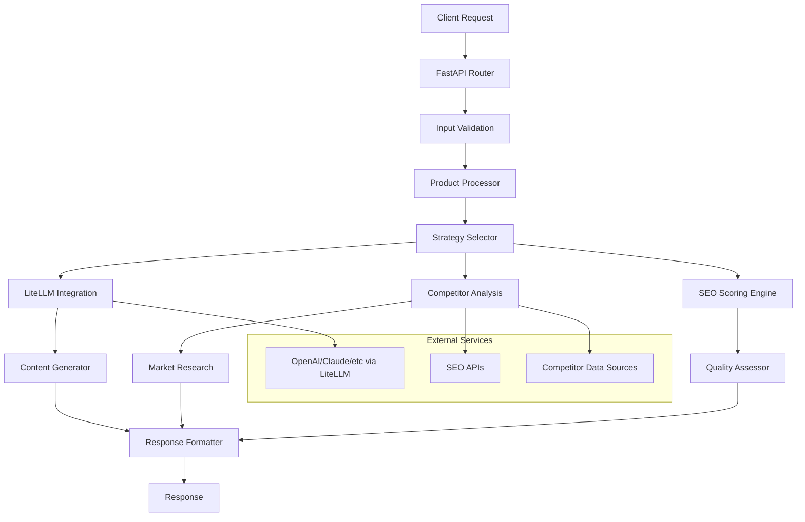

# SEO Meta Title & Description Optimization API - Development Plan

## Project Overview

Building an advanced **stateless** API that receives product information and returns professionally written, SEO-friendly meta title and description suggestions using AI-powered content generation, competitor analysis, and multiple optimization strategies.

> **Architecture Note**: This API is designed as a stateless service with no data persistence or caching layers. It processes requests in real-time and returns responses that can be consumed by other APIs during product creation workflows.

## Tech Stack

- **API Framework**: FastAPI (for speed and automatic docs)
- **Web Server**: Uvicorn (to run FastAPI)
- **AI/ML**: LiteLLM (for flexible LLM provider integration)
- **Containerization**: Docker
- **Testing**: pytest, httpx
- **Monitoring**: Prometheus + Grafana (optional)
- **Documentation**: FastAPI automatic docs + custom documentation

## API Specification

### Endpoint: POST /optimize-title

#### Input Schema
```json
{
  "product": {
    "current_title": "string",
    "features": ["string"],
    "category": "string",
    "brand": "string (optional)",
    "price_range": "string (optional)",
    "target_audience": "string (optional)",
    "keywords": ["string (optional)"]
  },
  "optimization_config": {
    "strategies": ["keyword_focused", "benefit_driven", "emotional_appeal", "technical_specs"],
    "competitor_analysis": true,
    "max_suggestions": 5,
    "include_descriptions": true
  }
}
```

#### Output Schema
```json
{
  "suggestions": [
    {
      "title": "string",
      "description": "string",
      "strategy": "string",
      "seo_score": "number",
      "character_counts": {
        "title": "number",
        "description": "number"
      },
      "keywords_used": ["string"],
      "optimization_notes": "string"
    }
  ],
  "competitor_insights": {
    "common_keywords": ["string"],
    "title_patterns": ["string"],
    "recommendations": ["string"]
  },
  "seo_analysis": {
    "original_score": "number",
    "best_suggestion_score": "number",
    "improvement_percentage": "number"
  }
}
```

## Architecture Design



## Development Phases

### Phase 1: Foundation Setup
- Project structure and environment setup
- FastAPI application skeleton
- Basic routing and middleware
- Docker containerization setup

### Phase 2: Core API Development
- Input/output data models (Pydantic)
- Product data validation and processing
- Basic endpoint implementation
- Error handling framework
- Logging system setup

### Phase 3: AI Integration
- LiteLLM integration and configuration
- Prompt engineering for different strategies
- Content generation pipeline
- Response quality validation
- Fallback mechanisms for API failures

### Phase 4: SEO Intelligence
- SEO scoring algorithms implementation
- Keyword density analysis
- Character limit optimization
- Meta tag best practices enforcement
- Performance metrics calculation

### Phase 5: Competitor Analysis
- Web scraping for competitor data
- Market research integration
- Keyword trend analysis
- Competitive positioning insights
- Industry-specific optimizations

### Phase 6: Advanced Features
- Multiple optimization strategies
- A/B testing framework
- Performance analytics
- Caching optimization
- Rate limiting and security

### Phase 7: Testing & Documentation
- Comprehensive test suite
- API documentation
- Performance benchmarking
- Security testing
- User guides and examples

### Phase 8: Deployment & Monitoring
- Production deployment setup
- Monitoring and alerting
- Performance optimization
- Scaling configuration
- Maintenance procedures

## Detailed Implementation Plan

### 1. Project Setup and Environment Configuration

**Objective**: Establish the development environment and project structure

**Tasks**:
- Create virtual environment and install dependencies
- Set up project directory structure
- Configure environment variables and secrets management
- Initialize Git repository with proper .gitignore
- Set up development tools (linting, formatting, pre-commit hooks)

**Dependencies**:
```
fastapi==0.104.1
uvicorn[standard]==0.24.0
pydantic==2.5.0
litellm==1.17.0
pytest==7.4.3
httpx==0.25.2
python-multipart==0.0.6
requests==2.31.0
beautifulsoup4==4.12.2
```

**File Structure**:
```
seo-optimizer-api/
├── app/
│   ├── __init__.py
│   ├── main.py
│   ├── config.py
│   ├── models/
│   ├── routers/
│   ├── services/
│   ├── utils/
│   └── tests/
├── docs/
├── requirements.txt
├── Dockerfile
└── README.md
```

### 2. Design API Architecture and Data Models

**Objective**: Define the core data structures and API architecture

**Data Models**:
- `ProductInput`: Input product information
- `OptimizationConfig`: Configuration for optimization strategies
- `TitleSuggestion`: Individual title/description suggestion
- `CompetitorInsight`: Competitor analysis results
- `SEOAnalysis`: SEO scoring and metrics
- `OptimizationResponse`: Complete API response

**Architecture Components**:
- Router layer for endpoint handling
- Service layer for business logic
- External service integrations
- Response formatting and validation

### 3. Implement Core FastAPI Application Structure

**Objective**: Build the foundational FastAPI application

**Components**:
- Main application setup with middleware
- Router configuration and endpoint definitions
- Dependency injection for services
- Exception handling and error responses
- Request/response logging
- Health check endpoints

### 4. Create Product Data Validation and Processing

**Objective**: Implement robust input validation and data processing

**Features**:
- Pydantic models for request validation
- Data sanitization and normalization
- Category classification and mapping
- Feature extraction and analysis
- Input quality scoring
- Validation error handling

### 5. Integrate LiteLLM for AI-powered Content Generation

**Objective**: Set up AI content generation using LiteLLM

**Implementation**:
- LiteLLM configuration for multiple providers
- Prompt templates for different strategies
- Content generation pipeline
- Response parsing and validation
- Error handling and fallbacks
- Cost tracking and optimization

**Optimization Strategies**:
- **Keyword-Focused**: Emphasize primary keywords and search terms
- **Benefit-Driven**: Highlight product benefits and value propositions
- **Emotional Appeal**: Use persuasive language and emotional triggers
- **Technical Specs**: Focus on technical features and specifications
- **Brand-Centric**: Emphasize brand authority and trust signals

### 6. Develop SEO Optimization Algorithms and Scoring

**Objective**: Create comprehensive SEO analysis and scoring system

**SEO Factors**:
- Title length optimization (50-60 characters)
- Description length optimization (150-160 characters)
- Keyword density and placement
- Readability and engagement metrics
- Click-through rate prediction
- Search intent alignment

**Scoring Algorithm**:
```python
def calculate_seo_score(title, description, keywords):
    score = 0
    
    # Length optimization (30% weight)
    title_length_score = optimize_length(title, 50, 60)
    desc_length_score = optimize_length(description, 150, 160)
    score += (title_length_score + desc_length_score) * 0.3
    
    # Keyword optimization (40% weight)
    keyword_score = analyze_keyword_usage(title, description, keywords)
    score += keyword_score * 0.4
    
    # Readability (20% weight)
    readability_score = calculate_readability(title, description)
    score += readability_score * 0.2
    
    # Uniqueness (10% weight)
    uniqueness_score = check_uniqueness(title, description)
    score += uniqueness_score * 0.1
    
    return min(score, 100)
```

### 7. Implement Competitor Analysis Functionality

**Objective**: Analyze competitor meta tags and market trends

**Features**:
- Web scraping for competitor data collection
- Keyword trend analysis
- Common pattern identification
- Market positioning insights
- Industry-specific recommendations
- Competitive gap analysis

**Data Sources**:
- Search engine results pages (SERPs)
- Industry-specific websites
- SEO tools APIs (SEMrush, Ahrefs)
- Social media platforms
- E-commerce marketplaces

### 8. Create Multiple Optimization Strategies

**Objective**: Implement diverse optimization approaches

**Strategy Implementations**:

1. **Keyword-Focused Strategy**:
   - Primary keyword in title (preferably at the beginning)
   - Secondary keywords in description
   - Long-tail keyword variations
   - Search volume optimization

2. **Benefit-Driven Strategy**:
   - Value proposition highlighting
   - Problem-solution framing
   - Benefit-focused language
   - Action-oriented descriptions

3. **Emotional Appeal Strategy**:
   - Emotional trigger words
   - Urgency and scarcity elements
   - Social proof indicators
   - Persuasive language patterns

4. **Technical Specs Strategy**:
   - Feature-focused titles
   - Specification highlights
   - Technical terminology
   - Product differentiation

### 9. Add Response Formatting and Validation

**Objective**: Ensure consistent and validated API responses

**Features**:
- Response model validation
- Data serialization optimization
- Error response standardization
- Response compression
- API versioning support

### 10. Implement Error Handling and Logging

**Objective**: Create robust error handling and monitoring

**Components**:
- Custom exception classes
- Global exception handlers
- Structured logging with correlation IDs
- Error tracking and alerting
- Performance monitoring
- Request/response logging

### 11. Create Comprehensive Testing Suite

**Objective**: Ensure code quality and reliability

**Test Types**:
- Unit tests for individual components
- Integration tests for API endpoints
- Performance tests for load handling
- Security tests for vulnerability assessment
- End-to-end tests for complete workflows

**Test Coverage**:
- Input validation scenarios
- AI integration edge cases
- SEO scoring accuracy
- Competitor analysis reliability
- Error handling robustness

### 12. Add API Documentation and Examples

**Objective**: Provide comprehensive documentation

**Documentation Components**:
- FastAPI automatic OpenAPI docs
- Custom API documentation
- Usage examples and tutorials
- Integration guides
- Best practices documentation
- Troubleshooting guides

### 13. Performance Optimization

**Objective**: Optimize API performance and response times

**Optimization Strategies**:
- Async processing for external API calls
- Response compression
- Connection pooling for external services
- Load balancing preparation
- Request/response optimization

### 14. Security Implementation

**Objective**: Secure the API against common threats

**Security Measures**:
- API key authentication
- Rate limiting per client
- Input sanitization and validation
- SQL injection prevention
- CORS configuration
- Security headers implementation
- Audit logging

### 15. Deployment Configuration and Containerization

**Objective**: Prepare for production deployment

**Deployment Components**:
- Docker containerization
- Kubernetes manifests for production
- CI/CD pipeline configuration
- Environment-specific configurations
- Health checks and monitoring setup
- Stateless deployment optimization

## Performance Requirements

- **Response Time**: < 3 seconds for standard requests (including AI processing)
- **Throughput**: Handle 50+ concurrent requests
- **Availability**: 99.9% uptime
- **Scalability**: Horizontal scaling capability (stateless design)
- **AI Response Time**: < 2 seconds for LLM calls

## Security Considerations

- API key authentication for access control
- Rate limiting to prevent abuse
- Input validation to prevent injection attacks
- Secure storage of API keys and secrets
- Audit logging for security monitoring
- Regular security assessments

## Monitoring and Analytics

- Request/response metrics
- AI API usage and costs
- Response time analytics
- Error rates and patterns
- Performance benchmarks
- External service availability

## Future Enhancements

- Machine learning model training on user feedback
- A/B testing framework for optimization strategies
- Multi-language support
- Industry-specific optimization templates
- Real-time competitor monitoring
- Advanced analytics dashboard

## Success Metrics

- API response accuracy (measured by user feedback)
- SEO score improvements (average 20%+ improvement)
- User adoption and retention rates
- API performance benchmarks
- Cost efficiency of AI integrations

## Risk Mitigation

- **AI API Failures**: Implement fallback mechanisms and multiple provider support
- **Rate Limiting**: Implement intelligent queuing and retry mechanisms
- **Data Quality**: Validate and sanitize all inputs and outputs
- **Performance**: Implement response optimization and async processing
- **Security**: Regular security audits and updates
- **Stateless Design**: Ensure no data persistence dependencies

This comprehensive plan provides a roadmap for building a robust, scalable, and feature-rich SEO optimization API that leverages AI for intelligent content generation while maintaining high performance and security standards.